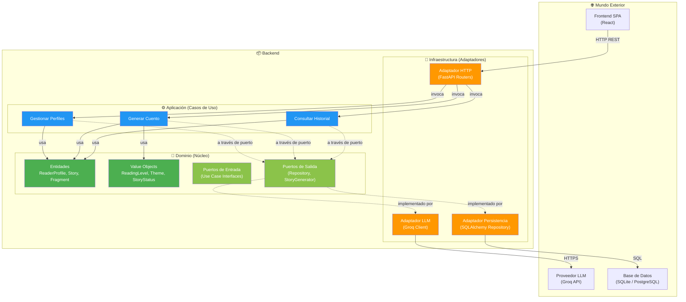
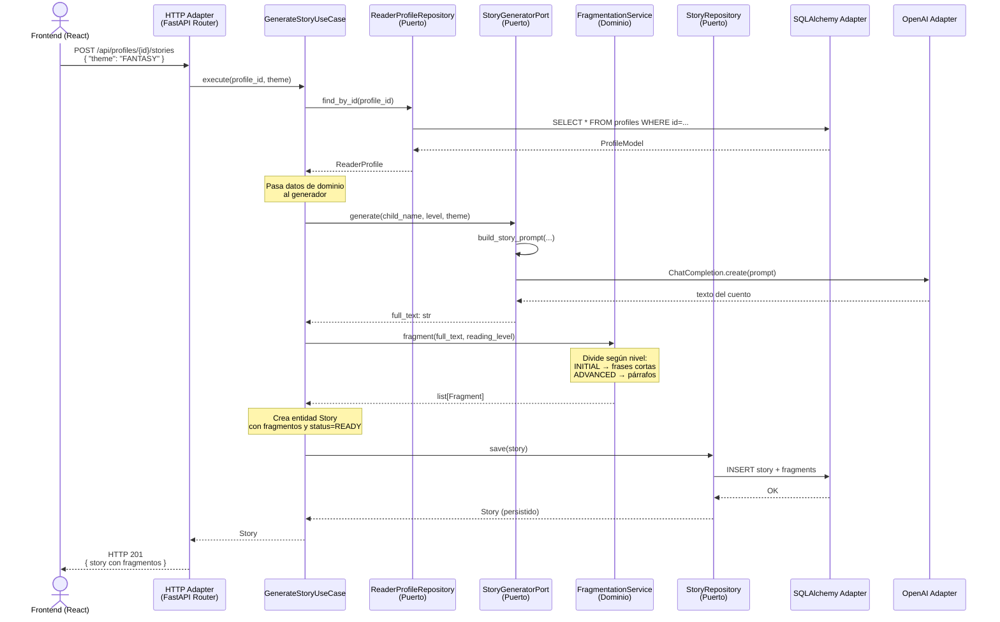
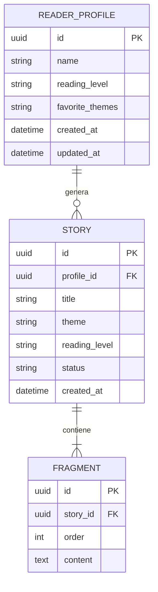

# Arquitectura — CuentoMágico Backend

**Versión:** 1.0
**Fecha:** Marzo 2026
**Rol:** Arquitecto de Software Senior

---

## 1. Visión General

El backend de CuentoMágico sigue una **arquitectura hexagonal** (Ports & Adapters), donde el dominio es el núcleo puro de la aplicación y toda interacción con el mundo exterior (HTTP, base de datos, LLM) ocurre a través de puertos e interfaces que el dominio define pero nunca implementa.

### Principios rectores

1. **El dominio es soberano**: entidades, value objects y reglas de negocio no dependen de ningún framework ni librería externa.
2. **Dependencias apuntan hacia adentro**: infraestructura → aplicación → dominio. Nunca al revés.
3. **Puertos como contratos**: toda comunicación con el exterior se define mediante interfaces abstractas (Protocols / ABCs).
4. **Adaptadores intercambiables**: se puede reemplazar SQLite por PostgreSQL, Groq por otro LLM, o Express por Fastify sin tocar dominio ni aplicación.

---

## 2. Diagrama de Componentes



---

## 3. Capas del Sistema

### 3.1 Dominio (Núcleo)

El dominio contiene las reglas de negocio puras. **No importa nada externo.**

#### Entidades

```
ReaderProfile
├── id: UUID
├── name: str
├── reading_level: ReadingLevel
├── favorite_themes: list[Theme]
├── created_at: datetime
└── updated_at: datetime

Story
├── id: UUID
├── profile_id: UUID
├── title: str
├── theme: Theme
├── reading_level: ReadingLevel
├── fragments: list[Fragment]
├── status: StoryStatus
├── created_at: datetime
└── fragment_count() → int

Fragment
├── id: UUID
├── story_id: UUID
├── order: int
├── content: str
└── is_last() → bool (determinado por contexto)
```

#### Value Objects (inmutables, sin identidad)

```
ReadingLevel  → Enum: INITIAL, BASIC, INTERMEDIATE, ADVANCED
Theme         → Enum: ANIMALS, FANTASY, ADVENTURE, NATURE, SPACE, FRIENDSHIP, HUMOR
StoryStatus   → Enum: GENERATING, READY, ERROR
```

#### Reglas de dominio

- Un `ReaderProfile` debe tener al menos un `Theme` favorito.
- Un `Story` siempre pertenece a un `ReaderProfile`.
- Los `Fragment` se ordenan por `order` (1-indexed).
- Un `Story` en estado `GENERATING` no puede ser leído aún.
- La fragmentación respeta el nivel lector: más fragmentos y más cortos para `INITIAL`, menos y más largos para `ADVANCED`.

#### Servicio de dominio: FragmentationService

```
FragmentationService
└── fragment(full_text: str, level: ReadingLevel) → list[Fragment]
```

Lógica pura que divide un texto completo en fragmentos según el nivel lector. No depende de ninguna infraestructura.

| Nivel | Estrategia de fragmentación |
|-------|---------------------------|
| INITIAL | Máximo 1–2 oraciones por fragmento (≈20–40 palabras) |
| BASIC | Máximo 2–3 oraciones (≈40–70 palabras) |
| INTERMEDIATE | Máximo 1 párrafo corto (≈70–120 palabras) |
| ADVANCED | Máximo 1–2 párrafos (≈120–200 palabras) |

---

### 3.2 Puertos (Interfaces)

Los puertos definen contratos que la capa de aplicación necesita pero no implementa.

#### Puertos de salida (driven ports)

```
ReaderProfileRepository (Protocol)
├── save(profile: ReaderProfile) → ReaderProfile
├── find_by_id(profile_id: UUID) → ReaderProfile | None
├── find_all() → list[ReaderProfile]
└── delete(profile_id: UUID) → bool

StoryRepository (Protocol)
├── save(story: Story) → Story
├── find_by_id(story_id: UUID) → Story | None
├── find_by_profile_id(profile_id: UUID) → list[Story]
└── delete(story_id: UUID) → bool

StoryGeneratorPort (Protocol)
└── generate(child_name: str, reading_level: ReadingLevel, theme: Theme) → str
```

> Los puertos se definen como `typing.Protocol` de Python (structural subtyping), no como ABCs. Esto permite que los adaptadores los implementen sin heredar explícitamente, manteniendo el desacoplamiento total. Ver ADR-001.

#### Puertos de entrada (driving ports)

Los casos de uso exponen métodos públicos que actúan como puertos de entrada. No necesitan una interfaz separada en un MVP porque el adaptador HTTP los invoca directamente.

---

### 3.3 Aplicación (Casos de Uso)

Orquestan el flujo entre dominio y puertos. Reciben dependencias por constructor (inyección).

```
CreateReaderProfileUseCase
├── __init__(repo: ReaderProfileRepository)
└── execute(name, level, themes) → ReaderProfile

GetReaderProfileUseCase
├── __init__(repo: ReaderProfileRepository)
└── execute(profile_id) → ReaderProfile

ListReaderProfilesUseCase
├── __init__(repo: ReaderProfileRepository)
└── execute() → list[ReaderProfile]

DeleteReaderProfileUseCase
├── __init__(repo: ReaderProfileRepository)
└── execute(profile_id) → bool

GenerateStoryUseCase
├── __init__(repo: StoryRepository, profile_repo: ReaderProfileRepository, generator: StoryGeneratorPort, fragmenter: FragmentationService)
└── execute(profile_id, theme_override?) → Story

GetStoryUseCase
├── __init__(repo: StoryRepository)
└── execute(story_id) → Story

ListStoriesByProfileUseCase
├── __init__(repo: StoryRepository)
└── execute(profile_id) → list[Story]

DeleteStoryUseCase
├── __init__(repo: StoryRepository)
└── execute(story_id) → bool
```

---

### 3.4 Infraestructura (Adaptadores)

#### Adaptador HTTP (FastAPI)

Traduce peticiones HTTP a invocaciones de casos de uso y viceversa.

```
Endpoints:

POST   /api/profiles              → CreateReaderProfileUseCase
GET    /api/profiles              → ListReaderProfilesUseCase
GET    /api/profiles/{id}         → GetReaderProfileUseCase
DELETE /api/profiles/{id}         → DeleteReaderProfileUseCase

POST   /api/profiles/{id}/stories → GenerateStoryUseCase
GET    /api/stories/{id}          → GetStoryUseCase
GET    /api/profiles/{id}/stories → ListStoriesByProfileUseCase
DELETE /api/stories/{id}          → DeleteStoryUseCase

GET    /health                    → Health check
```

#### Adaptador de Persistencia (SQLAlchemy)

Implementa `ReaderProfileRepository` y `StoryRepository`. Traduce entre entidades de dominio y modelos ORM.

```
SqlReaderProfileRepository
├── Implementa ReaderProfileRepository
├── Usa SQLAlchemy models internamente
└── Convierte ORM ↔ Entidad de dominio

SqlStoryRepository
├── Implementa StoryRepository
├── Persiste Story + Fragment en tablas relacionadas
└── Carga eager de fragmentos ordenados por `order`
```

#### Adaptador LLM (OpenAI)

Implementa `StoryGeneratorPort`. Construye y envía el prompt al proveedor LLM.

```
OpenAIStoryGenerator
├── Implementa StoryGeneratorPort
├── Lee API key de variable de entorno
├── Construye prompt con parámetros del perfil
└── Retorna texto plano generado
```

---

## 4. Diagrama de Secuencia: Crear Cuento



---

## 5. Estructura de Carpetas del Backend

```
backend/
├── app/
│   ├── __init__.py
│   ├── main.py                          # Punto de entrada FastAPI + composición
│   │
│   ├── domain/                          # 💎 Núcleo puro
│   │   ├── __init__.py
│   │   ├── entities/
│   │   │   ├── __init__.py
│   │   │   ├── reader_profile.py        # Entidad ReaderProfile
│   │   │   ├── story.py                 # Entidad Story
│   │   │   └── fragment.py              # Entidad Fragment
│   │   ├── value_objects/
│   │   │   ├── __init__.py
│   │   │   ├── reading_level.py         # Enum ReadingLevel
│   │   │   ├── theme.py                 # Enum Theme
│   │   │   └── story_status.py          # Enum StoryStatus
│   │   ├── ports/
│   │   │   ├── __init__.py
│   │   │   ├── reader_profile_repository.py  # Protocol
│   │   │   ├── story_repository.py           # Protocol
│   │   │   └── story_generator.py            # Protocol
│   │   └── services/
│   │       ├── __init__.py
│   │       └── fragmentation_service.py      # Lógica pura de fragmentación
│   │
│   ├── application/                     # ⚙️ Casos de uso
│   │   ├── __init__.py
│   │   ├── create_reader_profile.py
│   │   ├── get_reader_profile.py
│   │   ├── list_reader_profiles.py
│   │   ├── delete_reader_profile.py
│   │   ├── generate_story.py
│   │   ├── get_story.py
│   │   ├── list_stories_by_profile.py
│   │   └── delete_story.py
│   │
│   └── infrastructure/                  # 🔌 Adaptadores
│       ├── __init__.py
│       ├── http/
│       │   ├── __init__.py
│       │   ├── profile_router.py        # Endpoints de perfiles
│       │   ├── story_router.py          # Endpoints de cuentos
│       │   └── schemas.py               # Pydantic DTOs (request/response)
│       ├── persistence/
│       │   ├── __init__.py
│       │   ├── database.py              # Configuración SQLAlchemy engine/session
│       │   ├── models.py                # Modelos ORM
│       │   ├── profile_repository_impl.py
│       │   └── story_repository_impl.py
│       └── llm/
│           ├── __init__.py
│           ├── openai_generator.py      # Adaptador OpenAI
│           └── prompt_builder.py        # Construcción de prompts
│
├── .env.example                         # Variables de entorno de ejemplo
├── .env                                 # Variables reales (en .gitignore)
├── requirements.txt
└── README.md
```

---

## 6. Modelo de Datos



---

## 7. Flujo de Dependencias

```
                    ┌─────────────────┐
                    │   Infraestructura│
                    │  (Adaptadores)   │
                    └────────┬─────────┘
                             │ depende de
                             ▼
                    ┌─────────────────┐
                    │   Aplicación     │
                    │ (Casos de Uso)   │
                    └────────┬─────────┘
                             │ depende de
                             ▼
                    ┌─────────────────┐
                    │    Dominio       │
                    │ (Entidades,      │
                    │  Puertos, VOs)   │
                    └─────────────────┘

Las flechas apuntan hacia adentro.
El dominio NO depende de nada externo.
```

---

## 8. Composición (Wiring)

La composición de dependencias ocurre en `main.py`, el único lugar donde todas las capas se conocen entre sí:

```python
# Pseudocódigo de composición en main.py

# 1. Crear adaptadores de infraestructura
db_session = create_session(DATABASE_URL)
profile_repo = SqlReaderProfileRepository(db_session)
story_repo = SqlStoryRepository(db_session)
story_generator = OpenAIStoryGenerator(api_key=OPENAI_API_KEY)

# 2. Crear servicios de dominio
fragmentation_service = FragmentationService()

# 3. Crear casos de uso inyectando dependencias
generate_story_uc = GenerateStoryUseCase(
    story_repo=story_repo,
    profile_repo=profile_repo,
    generator=story_generator,
    fragmenter=fragmentation_service,
)

# 4. Registrar routers HTTP pasando los casos de uso
app.include_router(create_story_router(generate_story_uc))
```

---

## Referencias

- [ADR-001: Arquitectura hexagonal sobre MVC](./ADR-001.md)
- [ADR-002: Fragmentación como servicio de dominio](./ADR-002.md)
- [ADR-003: SQLite para desarrollo con ruta a PostgreSQL](./ADR-003.md)
- [ADR-004: Inyección manual de dependencias](./ADR-004.md)
- [ADR-005: Prompt engineering en capa de infraestructura](./ADR-005.md)
